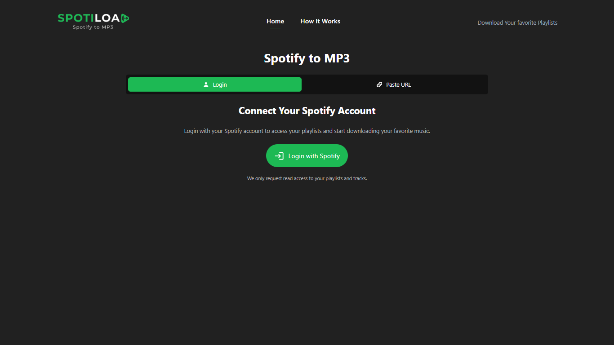
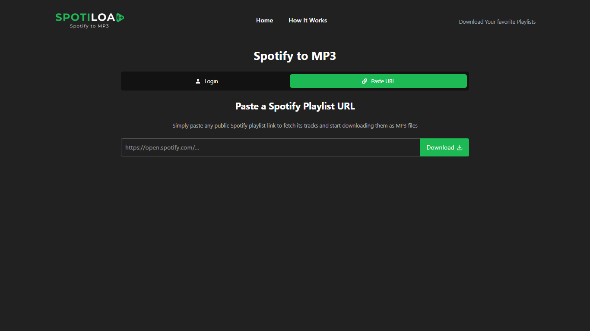
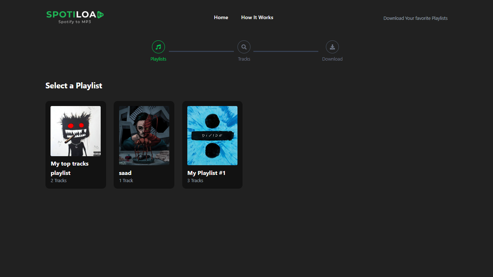
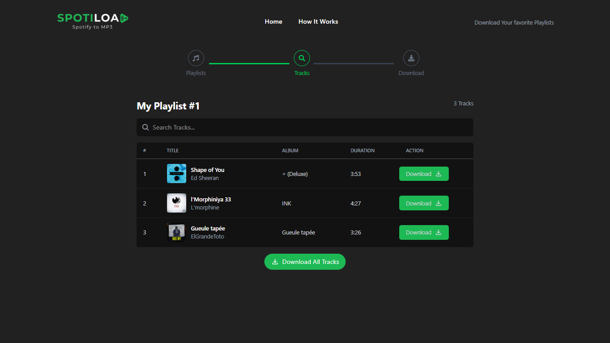
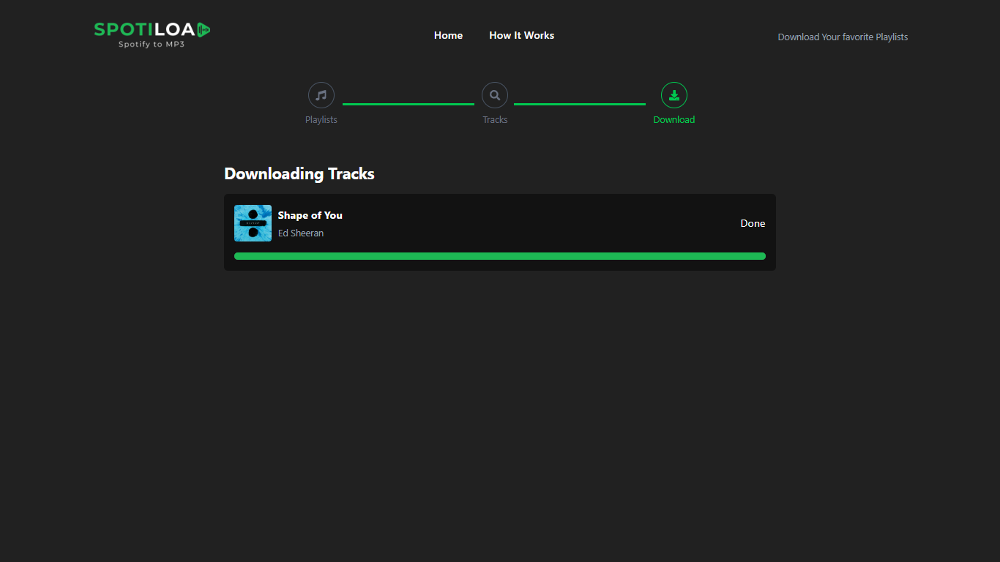

# Spotify-Downloader

<p align="center">
  
</p>

<p align="center">
  <!-- Version Badges -->
  
  
  <!-- Technology Badges -->
  
  
  
  
  
</p>

## Description

Spotify-Downloader is a web application that enables users to download tracks from Spotify playlists as MP3 files. You can log in with your Spotify account to access your playlists, or paste a public playlist URL. The app fetches playlist tracks and provides easy download options, including real-time progress updates.

**Key Features:**

- Login with Spotify or paste playlist URL
- Browse and select tracks
- Download tracks as MP3 or ZIP
- Real-time download progress

**Purpose:**  
Makes it easy to download Spotify playlist tracks for offline use, solving the hassle of accessing favorite music without an internet connection.

---

## Table of Contents

- [Installation](#installation)
- [Usage](#usage)
- [Configuration](#configuration)
- [API Reference](#api-reference)
- [Tests](#tests)
- [Contributing](#contributing)
- [License](#license)

---

## Installation

### Prerequisites

- Node.js (v18+)
- npm

### Step-by-step Instructions

```bash
git clone https://github.com/yourusername/Spotify-Downloader.git
cd Spotify-Downloader

# Backend setup
cd backend
npm install
npm run server

# Frontend setup
cd ../frontend
npm install
npm run dev
```

---

## Usage

1. **Login with Spotify:**  
   Authenticate to access your playlists.

2. **Paste Playlist URL:**  
   Enter a public Spotify playlist URL.

3. **Download:**  
   Select tracks and download as MP3 or ZIP.

**Screenshots:**







---

## Configuration

- **Environment Variables:**

  - `backend/.env`:
    - `SPOTIFY_CLIENT_ID`
    - `SPOTIFY_CLIENT_SECRET`
    - `SPOTIFY_REDIRECT_URI`
    - `VITE_FRONTEND_URL`
    - `PORT`
  - `frontend/.env`:
    - `VITE_BACKEND_URL`

- **Config Files:**
  - `backend/.env`
  - `frontend/.env`

---

## API Reference

- `GET /api/playlist`  
  Fetch playlist information from a Spotify URL.

- `GET /api/stream`  
  Stream and download individual tracks (uses Socket.io for progress).

- `POST /api/download-zip`  
  Download selected tracks as a ZIP file.

- `POST /api/auth`  
  Spotify authentication (login, callback, etc.).

---

## License

MIT License. See [LICENSE](LICENSE) for details.
